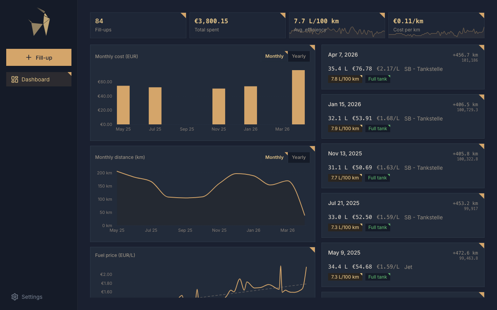
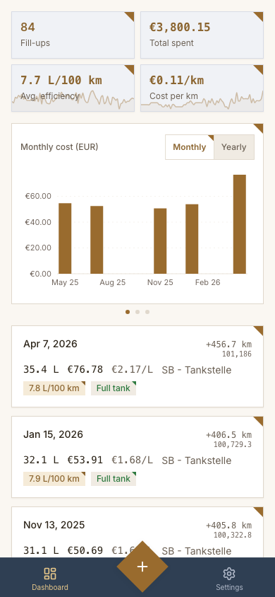

<p align="center">
  
</p>

<h1 align="center">gazel</h1>

<p align="center">
  <strong>gazel</strong> — short for <strong>ga</strong>s ga<strong>zel</strong>le — /ɡəˈzɛl/
</p>

<p align="center">
  <a href="https://conventionalcommits.org"></a>
  
  
  <a href="https://github.com/simplyRoba/gazel/releases"></a>
  <a href="https://github.com/simplyRoba/gazel/issues"></a>
  
</p>

A lightweight, self-hosted fuel expense and mileage tracker. Log fill-ups, track fuel efficiency and costs across your vehicles, and spot trends over time — all from a single binary with no external dependencies.

The gazel remembers every drop so you don't have to.

<p align="center">
  
  
</p>

## Features

- **Multi-vehicle tracking** — manage all your cars, motorcycles, and trucks in one place
- **Fill-up logging** — record date, odometer, fuel amount, cost, and station
- **Fuel efficiency** — automatic MPG / L/100km calculation between fill-ups
- **Cost tracking** — cost per mile/km, monthly and yearly spend breakdowns
- **Dashboard** — at-a-glance overview with summary stats and recent activity
- **Charts** — visualize efficiency, cost, and fuel price trends over time
- **Flexible units** — switch between imperial and metric, choose your currency
- **Multi-language** — English and German
- **Data portability** — export and import your data as JSON
- **Light & dark theme** — follows your system preference, with manual override
- **Installable PWA** — add to home screen on mobile for a native-like experience
- **Optional OIDC login** — protect the UI and API with a standards-based identity provider
- **Single binary** — self-contained Rust service with embedded UI, just run it or use Docker

## Quick start

### Docker run

```bash
docker run -p 4110:4110 -v gazel-data:/data \
  ghcr.io/simplyroba/gazel:latest
```

Open `http://localhost:4110`. Data is persisted in the `gazel-data` volume.

### Docker Compose

A `docker-compose.yml` is included in the repository.

```bash
docker compose up -d
```

## Configuration

| Variable                   | Default          | Description                                                          |
| -------------------------- | ---------------- | -------------------------------------------------------------------- |
| `GAZEL_PORT`               | `4110`           | HTTP server listen port.                                             |
| `GAZEL_DB_PATH`            | `/data/gazel.db` | Filesystem path to the SQLite database.                              |
| `GAZEL_LOG_LEVEL`          | `info`           | `tracing` level filter for logs.                                     |
| `GAZEL_AUTH_ENABLED`       | `false`          | Enable built-in OIDC authentication; accepts only `true` or `false`. |
| `GAZEL_EXTERNAL_URL`       | —                | Required public root origin when auth is enabled.                    |
| `GAZEL_OIDC_ISSUER`        | —                | Required OIDC issuer/discovery URL.                                  |
| `GAZEL_OIDC_CLIENT_ID`     | —                | Required confidential-client ID.                                     |
| `GAZEL_OIDC_CLIENT_SECRET` | —                | Required confidential-client secret.                                 |
| `GAZEL_OIDC_PROVIDER_NAME` | `OpenID Connect` | Optional display name used by the login button.                      |

## Security

Built-in authentication is disabled by default. Keep Gazel on a trusted network, place it behind an authenticating proxy, or enable OIDC.

To enable OIDC:

1. Create a confidential Authorization Code client with your provider.
2. Register `<GAZEL_EXTERNAL_URL>/auth/callback`.
3. Set `GAZEL_AUTH_ENABLED=true` and the required OIDC variables above.
4. Restart Gazel.

Gazel supports `client_secret_basic` and `client_secret_post`. Use HTTPS outside local loopback development. Invalid provider configuration prevents startup.

Important limitations:

- Every authenticated identity accesses the same shared Gazel data.
- Sessions expire after 12 hours and are lost when Gazel restarts.
- Signing out ends only the Gazel session, not the provider session.

## Development

See [CONTRIBUTING.md](CONTRIBUTING.md) for dev setup, testing, and design system documentation.

Copyright (C) 2026 simplyRoba.

**This project is developed spec-driven with AI assistance, reviewed by a critical human.**
